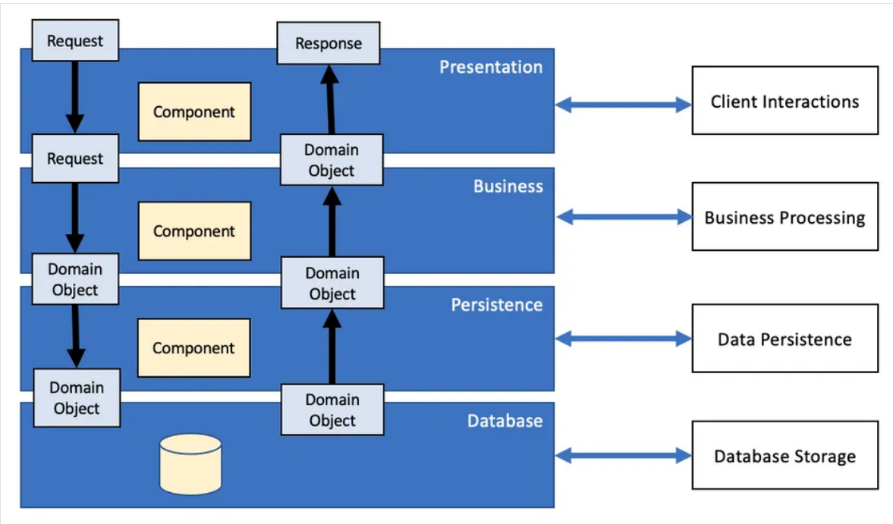

# The FlopBox platform developed in Java
- Author: ID-TALEB Réda
- Creation date: 05 march 2022

# Introduction
This project implements a platform called FlopBox which is used to centralize the management of remote files stored in a user's FTP servers. The user will be able to interact with his various FTP servers through the FlopBox API and this by using the services offered by the Restful API. There are many services, among them the user can retrieve or/and send files to an FTP server, etc. FlopBox follows a Restful architectural style, it is built with Java JAX-RS API.

# Running the FlopBox Platform
At the root level (where the pom.xml file exists), run these commands successively in a terminal:

Clean with:
```bash
$ mvn clean
```

Compile and generate the executable jar with:
```bash
$ mvn package
```

Run the jar (located at the root of the project) with:
```bash
java -jar target/sr2-tp1-idtaleb-1.0-SNAPSHOT.jar
```
# Test with cURL commands
In order to test the API with Curl commands you can read the [commands.md](https://github.com/reda-idtaleb/FlopBox_RestFul_API/blob/master/commands.md). All Curl commands are reported there.

# Project tree structure
<pre><font color="#3465A4"><b>.</b></font>
├── <font color="#3465A4"><b>application</b></font>
│   └── Main.java
├── <font color="#3465A4"><b>authentication</b></font>
│   ├── AuthenticationFilter.java
│   └── PasswordEncryption.java
├── <font color="#3465A4"><b>data</b></font>
│   ├── DataBaseInfo.java
│   └── JsonDataBase.java
├── <font color="#3465A4"><b>exceptions</b></font>
│   ├── AliasAlreadyExistException.java
│   ├── AliasNotFoundException.java
│   ├── BadGatewayException.java
│   ├── BadRequestException.java
│   ├── CannotDiconnectFromFTPServerException.java
│   ├── CannotListDirectoryException.java
│   ├── CannotLoginException.java
│   ├── CannotLogoutFromFTPServerException.java
│   ├── ConflictResourceException.java
│   ├── CustomerAlreadyExistsException.java
│   ├── CustomerNotFoundException.java
│   ├── FTPServerAlreadyConnectedException.java
│   ├── FTPServerConnectionException.java
│   ├── IncorrectAuthenticationException.java
│   ├── InternalServerErrorException.java
│   ├── JSONFieldValueException.java
│   ├── NotFoundResourceException.java
│   ├── UnauthorizedUserException.java
│   ├── UnmatchedJSONKeysException.java
│   └── UnmatchedJSONValuesException.java
├── <font color="#3465A4"><b>repository</b></font>
│   ├── CustomerRepositoryImp.java
│   ├── CustomerRepository.java
│   ├── <font color="#3465A4"><b>factory</b></font>
│   │   ├── CustomerRepositoryFactory.java
│   │   ├── RepositoryFactory.java
│   │   └── ServerRepositoryFactory.java
│   ├── RepositoryImp.java
│   ├── Repository.java
│   ├── ServerRepositoryImp.java
│   └── ServerRepository.java
├── <font color="#3465A4"><b>resources</b></font>
│   ├── CustomerResource.java
│   ├── FTPFileResource.java
│   ├── FTPServerResource.java
│   ├── ResourceImp.java
│   └── Resource.java
├── <font color="#3465A4"><b>services</b></font>
│   ├── <font color="#3465A4"><b>customers</b></font>
│   │   ├── CustomerEntity.java
│   │   └── CustomerService.java
│   ├── <font color="#3465A4"><b>ftp_files</b></font>
│   │   ├── AbstractFTPFileComponentEntity.java
│   │   ├── FTPDirectoryEntity.java
│   │   └── FTPFileEntity.java
│   ├── <font color="#3465A4"><b>servers</b></font>
│   │   ├── FTPFileService.java
│   │   ├── FTPServerEntity.java
│   │   ├── FTPServerService.java
│   │   └── FTPServerSession.java
│   └── Serviceable.java
└── <font color="#3465A4"><b>utils</b></font>
    ├── AllowedDataFields.java
    └── CustomJacksonMapperProvider.java

12 directories, 51 files
</pre>

# Architecture
## Conception
The FlopBox platform is developed in several architectural layers. This pattern is called `Layered Architecture`. This design pattern allows you to organize the API into several code units, each playing a specific role.

Here is a diagram summarizing the layered organization of the FlopBox platform:



### **Nous allons spécifier ces trois couches:**

- **Client interaction layer** 

	This layer is to handle client requests sent over HTTP. This layer contains Controllers, which receive requests from clients, forward them to the Service layer, and return the results to clients. The data exchanged between the Controller and the client is in JSON format.
	- At this layer, a `Resource` interface is defined which will be used to define the methods for sending and receiving HTML requests to clients.

- **Business layer** 
	
	This layer is to implement the basic logic of the API. The `Serviceable` interface allows to group the service classes used in this layer to implement all the business logic.
	- In this level, another design pattern is implemented. This is the composite. The abstract class `AbstractFTPFileComponentEntity` allows to model the tree structure of the directories of an FTP server. 

- **Persistence layer** 
	
	This layer consists of providing an interface to access the database. This layer contains a `Repository` interface which implements create, retrieve, update and delete (CRUD) operations.
	- Another design pattern used in this layer is the `Abstract Factory`. The `RepositoryFactory` interface allows you to create an instance of a repository without defining the "repositories" classes concretely at the Business layer level.

- **Database layer** 
	
	This database layer is used to store domain objects (like CustomerEntity and FTPServerEntity). A JSON database is used at this level. 

> **UML diagrams for each layer are available in the /docs folder.**

## Error handling:
Error handling is reinforced in the FlopBox platform and specifically client-side errors.
In what follows, a list of exceptions is developed and grouped into large families.
* Bad request: These exceptions are thrown when the user sends badly constructed data.
	- JSONFieldValueCannotBeEmptyException
	- UnmatchedJSONKeysException
	- UnmatchedJSONValuesException
	> If one of these exceptions is raised then a BadRequest(400) response is sent back to the client and the requested request is not processed.
	```java
	catch (BadRequestException e) {
	codeResponse = Response.Status.BAD_REQUEST;
	reply = e.getMessage();
	}
	```
* Bad gateway: These exceptions are thrown when the remote FTP server returns failure responses or throws I/O exceptions while transferring data.
	- IOException
	- CannotDiconnectFromFTPServerException
	- FTPServerConnectionException
	> If one of these exceptions is raised then a BadGateway(502) response is sent back to the client. If a transfer is in progress then it is suspended.
	```java
	catch (BadGatewayException e) {
	responseCode = Response.Status.BAD_GATEWAY;
	reply = e.getMessage();
	}
	```

* Conflict: These exceptions are raised when resources are already present and the user cannot access them. For example if a user registers in the platform with a username already taken or if a user creates the same alias twice to associate them with different FTP servers. A special case is when a connection to the FTPServer is already established and a new connection is requested when it is already open.
	- CustomerAlreadyExistsException
	- FTPServerAlreadyConnectedException
	- AliasAlreadyExistException
	> If one of these exceptions is raised then a CONFLICT(409) response is sent back to the client.
	```java
	catch (ConflictResourceException e) {
	codeResponse = Response.Status.CONFLICT;
	reply = e.getMessage();
	}
	```

* Not found resource: These exceptions are thrown when a user requests resources that do not exist.
	- AliasNotFoundException
	- CannotLoginException
	- CannotListDirectoryException. -> If a directory cannot be listed
		-FileNotFoundException
	- InternalServerErrorException -> when an internal error occurs within the FlopBox platform (for example writing/reading in the datbase impossible, compilation errors on the databse).
	> If one of these exceptions is raised then a NotFound(404) response is sent back to the client.
	```java
	catch (NotFoundResourceException e) {
	codeResponse = Response.Status.NOT_FOUND;
	reply = e.getMessage();
	}
	```

* Unauthorized: These exceptions are raised when a user does not provide the correct authentication keys linked to his account on the FlopBox platform or if a user is not yet registered on the platform (access is prohibited) .
	- CustomerNotFoundException
	- IncorrectAuthenticationException
	> If one of these exceptions is thrown then an Unauthorized(401) response is sent back to the client.
	```java
	catch (UnauthorizedUserException e) {
	codeResponse = Response.Status.Unauthorized;
	reply = e.getMessage();
	}
	```
